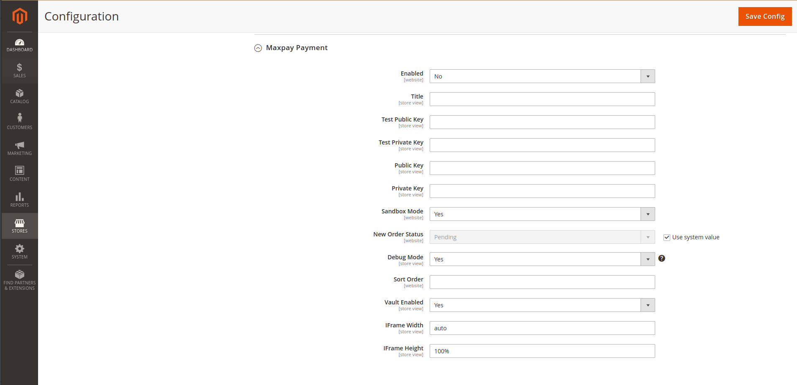

# Maxpay Payment module

Module for integration with Maxpay Payment Gateway.

## Installation

### Install the module using Composer

1. Set up the module by running the following commands:
    ```bash
    composer require maxpay/payment
    php bin/magento setup:upgrade
    php bin/magento cache:flush
    php bin/magento cache:clean
    ```
2. If you run Magento in production mode, you also must compile and deploy the module’s static files:
    ```bash
    php bin/magento setup:di:compile
    php bin/magento setup:static-content:deploy

### Configure url's in your Maxpay Merchant Portal
1. Website url
   https://yourdomain.com/
2. Success url
   https://yourdomain.com/maxpay/redirect
3. Decline url
   https://yourdomain.com/maxpay/redirect/decline
4. Callback url
   https://yourdomain.com/maxpay/iframe/callback
5. Back button url
   https://yourdomain.com/maxpay/redirect/history

## Configuring the Magento 2 Module

### Find the module configuration options

Navigate to the configuration section for the Maxpay module (**Stores > Configuration > Sales > Payment Methods**):


### Configuration options

* **Enabled:** Enable or disable the payment method at checkout.
* **Title:** This is the name of the payment method as shown on the checkout page.
* **Test Public Key:** Test public key from Maxpay Merchant Account.
* **Test Private Key:** Test secret key from Maxpay Merchant Account.
* **Public Key:** Public key from Maxpay Merchant Account.
* **Private Key:** Secret key from Maxpay Merchant Account.
* **Sandbox Mode:** Enable or disable sandbox mode.
* **New Order Status:** Enable or disable sandbox mode.
* **Debug Mode:** Enable or disable debug mode. All API request will be stored in `var/log/maxpay_payment.log` file.
* **Sort Order:** If you have enabled multiple payment methods, this setting determines the order of payment methods presented on the checkout page. 
* **Vault Enabled:** Enable or disable Magento Vault (provides store customers with ability to use the previously saved credit card information for checkout)
* **Iframe Width:**  Setup width for Maxpay Iframe
* **Iframe Height:** Setup height for Maxpay Iframe

